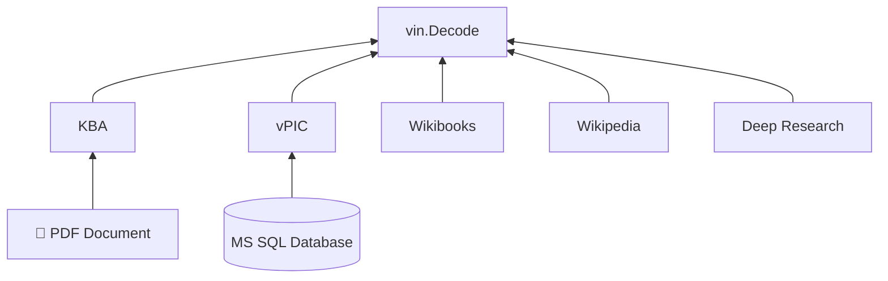

# vin-go

[](https://pkg.go.dev/github.com/way-platform/vin-go)
[](https://goreportcard.com/report/github.com/way-platform/vin-go)
[](https://opensource.org/licenses/MIT)

A Go SDK for decoding Vehicle Identification Numbers (VINs).

## Features

- **Standards Compliant**: ISO 3779 and SAE J1044 parsing logic.
- **OEM-specific Decoding**: Parsers for European commercial vehicles
- **Data Enrichment**: Integrated datasets from NHTSA vPIC, German KBA, and open sources.
- **Validation**: Check digit verification (North America) and structural analysis.
- **Structured Output**: Strictly typed Protobuf / JSON data model.

## Installation

### Library

```bash
go get github.com/way-platform/vin-go
```

### CLI

```bash
go install github.com/way-platform/vin-go/cmd/vin@latest
```

## Usage

### Library

```go
package main

import (
    "fmt"
    "log"

    "github.com/way-platform/vin-go"
)

func main() {
    v := "W1T98300010712345"
    decoded, err := vin.Decode(v)
    if err != nil {
        log.Fatalf("Error: %v", err)
    }
    fmt.Printf("Region: %s\n", decoded.GetRegion())
    fmt.Printf("Manufacturer: %s\n", decoded.GetManufacturer().GetDisplayName())
    fmt.Printf("Brand: %s\n", decoded.GetVehicle().GetBrand())
    fmt.Printf("Model: %s\n", decoded.GetVehicle().GetModel())
}
```

### CLI

```bash
vin decode W1T98300010712345
```

**Output (JSON):**

```json
{
  "value": "W1T98300010712345",
  "wmi": "W1T",
  "vds": "983000",
  "vis": "10712345",
  "year": 2001,
  "region": "EUROPE",
  "country": "GERMANY",
  "calculatedCheckDigit": "0",
  "checkDigitValid": true,
  "manufacturer": {
    "kbaId": 7070,
    "country": "GERMANY",
    "brands": ["MERCEDES_BENZ"],
    "dataSources": ["KBA", "WIKIBOOKS"]
  },
  "vehicle": {
    "brand": "MERCEDES_BENZ",
    "type": "HEAVY_GOODS_VEHICLE",
    "model": "E_ACTROS",
    "fuelTypes": ["ELECTRIC"],
    "dataSources": ["DEEP_RESEARCH"]
  }
}
```

## Data Sources

This SDK combines data from various sources to provide comprehensive VIN decoding. The following diagram illustrates the primary data flows:



- **NHTSA vPIC**: [US market manufacturer database](https://vpic.nhtsa.dot.gov/).
- **KBA (Kraftfahrt-Bundesamt)**: [German Federal Motor Transport Authority database](https://www.kba.de/).
- **Deep Research**: Manual analysis of OEM body builder guides and homologation documents.
- **Wikipedia**: [Wikipedia page on VINs](https://en.wikipedia.org/wiki/Vehicle_identification_number).
- **Wikibooks**: [Wikibooks book on VINs](<https://en.wikibooks.org/wiki/Vehicle_Identification_Numbers_(VIN_codes)>).

## Development

### Prerequisites

- Go 1.24+

### Build

```bash
./tools/mage build
```

## License

MIT License - see [LICENSE](LICENSE) for details.
